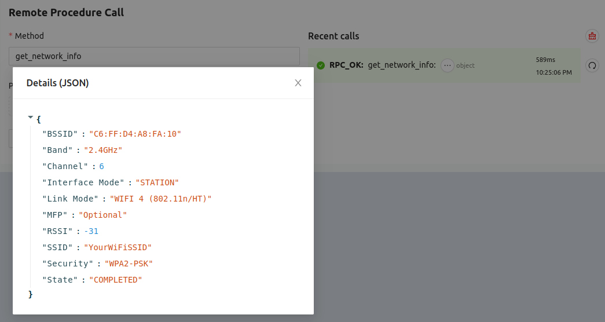

Section 1: IoT
##############

The IoT sample demonstrates an IoT device that connects to WiFi and Golioth,
then sends data, logs, and reacts to remote-procedure calls. Using this sample
code you will learn about:

* Building and flashing applications in Zephyr
* Adding persistent credentials using the serial shell
* Get to know the Golioth web console:
   * Time-series and stateful data reported to the cloud
   * Adjusting device settings using the cloud-side Settings service
   * Receiving remote logging information from the device
   * Using remote procedure call (RPC) to return current WiFi connection info

Hardware
********

This demonstrates how to interact with the `Golioth Cloud`_ using `Zephyr`_ on
any of the following boards:

* `Nordic nRF7002 Development Kit`_.
* `Nordic nRF9160 Development Kit`_.

Build Instructions
******************

Prerequisites
=============

Follow the README in the root of this repository to install a
virtual environment and use `west init`/`west update` to clone all dependencies.
Remember to restart your virtual environment when beginning a new terminal
session.

Build project
=============

From the root directory of this repository, build using the following command:

.. code-block:: bash

   $ # Building for nRF7002dk
   $ (.venv) west build -b nrf7002dk_nrf5340_cpuapp 01_IOT

   $ # Building for nRF9160dk
   $ (.venv) west build -b nrf9160dk_nrf9160_ns 01_IOT

Flash project
=============

Connect your computer to the board via USB. (On the nRF7002dk, do not use the
USB port labelled `nRF USB`.) Run the following command:

.. code-block:: bash

   $ (.venv) west flash

Add credentials
===============

Use a serial terminal program to connect to the device using 115200 8N1 as the
settings.

nRF7002dk
---------

* Use the **highest** numbered port
* Use the following syntax to store your WiFi and Golioth credentials on the
  device:

.. code-block:: bash

   uart:~$ settings set wifi/ssid <my-wifi-ap-ssid>
   uart:~$ settings set wifi/psk <my-wifi-ap-password>
   uart:~$ settings set golioth/psk-id <my-psk-id@my-project>
   uart:~$ settings set golioth/psk <my-psk>
   uart:~$ kernel reboot cold

nRF9160dk
---------

* Use the **lowest** numbered port
* Use the following syntax to store your Golioth credentials on the device:

.. code-block:: bash

   uart:~$ settings set golioth/psk-id <my-psk-id@my-project>
   uart:~$ settings set golioth/psk <my-psk>
   uart:~$ kernel reboot cold

Application Behavior
********************

When the app begins running it will connect to WiFi, then connect to Golioth and
begin streaming simulated temperature sensor data:

.. code-block::

   *** Booting nRF Connect SDK v2.5.2 ***
   [00:00:00.472,961] <inf> fs_nvs: 2 Sectors of 4096 bytes
   [00:00:00.472,961] <inf> fs_nvs: alloc wra: 0, f90
   [00:00:00.472,991] <inf> fs_nvs: data wra: 0, 154
   [00:00:00.473,602] <dbg> golioth_iot: main: Start Golioth IoT
   [00:00:00.473,663] <inf> golioth_samples: Bringing up network interface
   [00:00:00.473,663] <inf> golioth_samples: Waiting to obtain IP address
   [00:00:02.681,610] <inf> lte_monitor: Network: Searching
   [00:00:04.387,664] <inf> lte_monitor: Network: Registered (roaming)
   [00:00:04.388,763] <inf> golioth_mbox: Mbox created, bufsize: 1232, num_items: 10, item_size: 112
   [00:00:06.575,164] <inf> golioth_coap_client_zephyr: Golioth CoAP client connected
   [00:00:06.575,683] <inf> golioth_iot: Hello Golioth! 0
   [00:00:06.575,714] <inf> golioth_iot: Streaming Temperature to Golioth: 27.270000
   [00:00:06.575,897] <inf> golioth_iot: Golioth client connected
   [00:00:06.575,927] <inf> golioth_coap_client_zephyr: Entering CoAP I/O loop
   [00:00:07.245,117] <inf> golioth_rpc: RPC observation established
   [00:00:07.339,355] <dbg> golioth_iot: temperature_push_handler: Temperature successfully pushed
   [00:00:11.575,927] <inf> golioth_iot: Hello Golioth! 1
   [00:00:11.575,988] <inf> golioth_iot: Streaming Temperature to Golioth: 27.730000
   [00:00:12.716,247] <dbg> golioth_iot: temperature_push_handler: Temperature successfully pushed
   [00:00:16.576,202] <inf> golioth_iot: Hello Golioth! 2
   [00:00:16.576,263] <inf> golioth_iot: Streaming Temperature to Golioth: 27.930000
   [00:00:17.281,219] <dbg> golioth_iot: temperature_push_handler: Temperature successfully pushed

Button and LEDs
===============

One LED will always be blinking. Pressing the user buttons will change which LED
is currently blinking

Time-Series and Stateful Data
=============================

Simulated temperature readings will be sent periodically to Golioth. Each of
these readings is recorded with a timestamp when it was received.

When the user buttons are pressed to change which LED is blinking, the name of
the currently blinking LED (`LED` or `LED2`) will be recorded on the Golioth
LightDB State service.

Sensor Reading and LED Blinking Frequency
=========================================

The Golioth Settings Service determines the frequency at which simulated
temperature readings are sent and the frequency at which the LED blinks. The
following keys are used for these settings:

* Sensor frequency (seconds): `LOOP_DELAY_S`
* Blink frequency (milliseconds): `BLINK_DELAY_MS`

Reporting Network Connection Information
=====================================

A remote procedure call can be used to return information about the network to
which the device is currently connected:

* `get_network_info`

.. _Golioth Cloud: https://golioth.io/
.. _Zephyr: https://www.zephyrproject.org/
.. _Nordic nRF7002 Development Kit: https://www.nordicsemi.com/Products/Development-hardware/nRF7002-DK
.. _Nordic nRF9160 Development Kit: https://www.nordicsemi.com/Products/Development-hardware/nRF9160-DK

